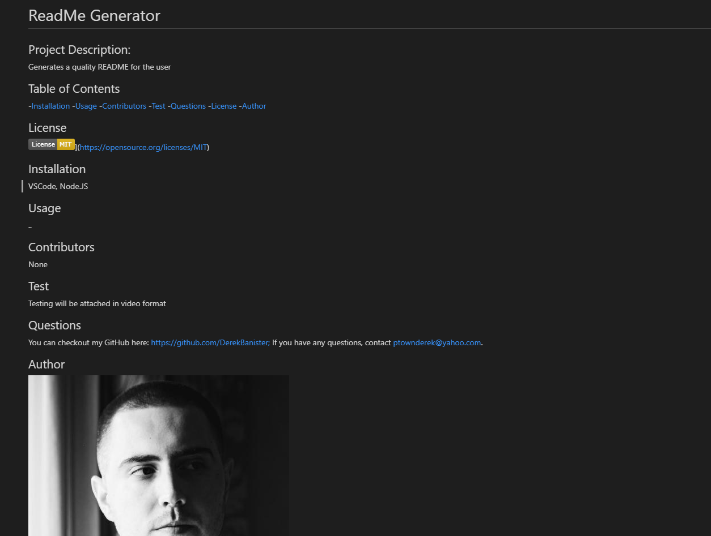

# README Generator

* This application generates a quality README based on user inputs from the command line using Node.JS and NPM Inquirer.

[Video of Application in action](https://www.youtube.com/watch?v=KmUDu_6x1t8)

## Built With

* [Javascript](https://www.javascript.com/)
* [Node.JS](https://nodejs.org/en/)
* [Axios](https://axios-http.com/docs/intro)
* [NPM Inquirer](https://www.npmjs.com/package/inquirer)

## Instructions
Steps to install application:

1. Clone repository.
2. Enter the directory with index.js run npm install
3. Run Index.js in command line, make sure Node.JS is installed.
4. Start server and answer prompts
5. README will be generated

## Authors

* **DEREK BANISTER** 

- [Link to Portfolio Site](https://derekbanister.github.io/First-Portfolio/)
- [Link to Github](https://github.com/DerekBanister)
- [Link to LinkedIn](https://www.linkedin.com/in/derek-banister/)

## Image of example generated README

